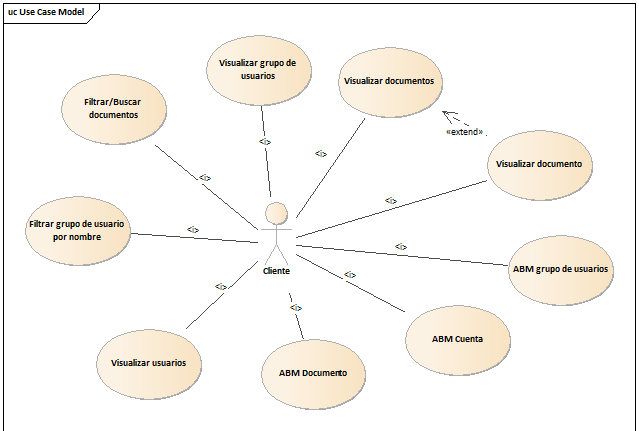

# Bienvenido!

Este es un sistema de gestión, el cúaal me permite hacer una gestión completa como usuario (Registro, inicio, cierre de sesión, darse de baja, etc) aplicando un método de seguridad (JsonWebToken). Otra funcionalidad del sistema es poder subir documentos y crear un registro de los mismo, asignando un propietario, un visibilidad, gruppo de ppersonas que pueden acceder, eliminarlo. Tambien podemos crear grupos de personas para que al momento de asignar un grupo de personas a un documento, sea mucho mas práctico.

<h2>¿Quien soy?</h2>

      Soy un programador Full Stack ​🧑‍💻​ y estudiante avanzado de Ingeniería en sistemas de información 👨‍💻.

 Tanto Front-end como Back-end me son muy atractivos a la hora de trabajar, lo cual me lleva a esforzarme en ambos para que sea un programa totalmente escalable, organizado y realizado con muchas ganas. Soy fanático de la organización y de las buenas prácticas de la ingeniería de software

<h2>Ahora sí, vamos a la documentación</h2>
# Documentación

Presentamos de lo que sería la primera iteración.

## Requerimientos

- Dar de alta un documento.
- Modificar un documento.
- Eliminar un documento.
- Ver todos los documentos.
- Ver detalle de un documento.
- Filtrar/Buscar documento por nombre/propietario/fechaSubida.
- Iniciar sesión usuario.
- Registrar usuario.
- Cerrar sesión usuario.
- Descargar documento.
- Asignar un usuario a un documento.
- Asignar grupo de usuarios a un documento.
- Asignar usuario a grupo.
- Sacar usuario de un grupo.
- Eliminar grupo.
- Cerrar sesión de cuenta con token expirado.
- Buscar grupo de usuarios por nombre

## Diagrama de clases

# Mejoras a implementar para la segunda iteración
- Solamente el usuario que creo el grupo puede eliminarlo.
- Añadir roles (Admin, usuario común, etc.).
- El usuario puede bloquear a otros usuarios.
- Validación de registro con mail.
- Aplicar Unit test (UT).
- Individualizar el nombre del archivo.
- Aplicar mejoras de seguridad.
# Tecnologías implementadas
- **Back-End**
    - Node.js
    - Express
    - Express-fileupload
    - JWT
    - Mongoose
    - Bcrypt
    - TypeScript
    - MongoDB

- **Front-End**
    - React
    - HTML5
    - CSS3
    - JavaScript
    - Redux
    - Axios

# Puesta en marcha "Backend"

- Debemos posicionarnos en la carpeta de server.
- En la consola, ejecutar "npm install", esto instalara las dependencias del proyecto.
- Una vez realizado esto, comprobamos que tenemos la instancia de MongoDB funcionando para almacenar los datos.
- En la consola ejecutamos "npm run build" para transpilar el código TypeScript a JavaScript (Manera mejorada).
- Para ejecutar el proyecto, colocamos en la consola "npm run start".
- Se adjunta una colección de "Postman" para poder hacer la request.

# Puesta en marcha "FrontEnd" (EN CONSTRUCCIÓN)

- Debemos posicionarnos en la carpeta de server.
- En la consola, ejecutar "npm install", esto instalara las dependencias del proyecto.
- Una vez realizado esto, comprobamos que tenemos la instancia de MongoDB funcionando para almacenar los datos.
- En la consola ejecutamos "npm run build" para transpilar el código TypeScript a JavaScript (Manera mejorada).
- Para ejecutar el proyecto, colocamos en la consola "npm run start".
- Se adjunta una colección de "Postman" para poder hacer la request.

 
<h1>Contactos: </h3>

  
  <a href="https://github.com/Lean97-start" target="blank"><img align="center" src="data:image/png;base64,iVBORw0KGgoAAAANSUhEUgAAAOEAAADhCAMAAAAJbSJIAAAAhFBMVEX///8AAAD29vb8/Pzw8PBzc3PY2Nifn5/e3t7z8/O5ubnJycnn5+dwcHDU1NTb29vAwMA6OjoxMTGxsbFaWlpkZGRJSUnPz8+MjIyoqKh8fHwkJCRUVFQODg6VlZUrKyuBgYEZGRlNTU2jo6M/Pz+ZmZk2NjYXFxcNDQ1oaGhfX18uLi5QXcejAAALiklEQVR4nO1d2XaqShCNiIqC84BxiKDGRPP//3fVnEQaetg9QJF13W9nrYPpDd01V/XLyxNPPPHEE0+Qo9mNgmH7irh36NxxeO2F7WEQRJHf9aiXZ4nBtLNczY8fDR7W48Xm0l92pmFEvU4TXL9c73xMudTy2K5P+/4h9v/S94ynqwlEjsHsEPrUK4cwXG7W+vTu+Fi0ek3q9cvhx8utIbtf7KcBNQ0hhsuZLb07JvX8ktF07ITeP6yCmpGMk51Lfje0RvXh2Iw3fJVnh+1xWg+OXm9TAr1vTF5roD+mbqSLCIs3Wnr+1PnxK4LyO5a4P7OYjYj4BftK+N2woTACoqQyfld8LrtVE+w51e8AFtVu1eBcMb8b+hVu1c4XAcGrduxVxC8oVwPKsKpEcfQqUIFCLOLS+fmVitAitoeSbdX2kZZgo+yd2jONT7jEvjyZ6i2pyf1DaapxTs3sB5+dUvhFC2piGbRKCK4GdSLYaMydy5s2pRbkYeyY4qgOQpTF0alIDa3jvCVg4vArvlKT4eNr6IrglJqKCGNHebkeNRExJk7OYphS85Bg4eArDlNqFlKcrOM3wYmagwILW4lK7y2pMLPi51UT8rXDyoYhsUMP4tWcYE01fQGhKcEB9cpRpIY6I6q/lPnB2Uxn0IVF9ZGYEFQewtNskVaw+Kv5eV6+rRT+qUHoJpSn5n9CJVGntSjRtTq1Dj8bsCP9j7u2NkNF0CJ5/E8/7JTkH1+yxUOevJBsrktQEThcs0a9N3IvlSZvERveXsn/v6ZWjBU7r/jGRn135K7YFMui2vIn1lr+sKeSo5w8lzdwl1Q8jjji31OchbNORkN+qq/ghysDxUYCMefnCZstxXMa+zRSlTilIg3r4Dyue6Jor0p/rWFHSvmyGhtxyLlQwLddT8aLzeyKy7n1i/78Mtsvxl/5nZcuxXttpFpWgjJU/lJjJdny0WOLj1vL1+koHkY+9/97ftSOe9PO8vK7Z84DybpilVL6RPOnqZLhu/T54CpW18dWGHXBs+/5w+RmH+3kpXpqQ/mI/b03JcHGVPET4VTf2o+m74pzBPjjqoXdgURmqiqKyOGiXNgeETZIGpSIIaBwgcyiDxAsLwkrB2A2CfXYA0pNQcgQWVui+pF2CvzKJxFDxGRaKwL9TSi6RsUQWpziJA6R3yDbpZDZu5MrKjBAWmeGcgPcwwjWWJZesZX9BBoCrq8+vEFi2HTRACINQzSLInGFQ5AgZv45R4BWXosdFDjUIvctygKcjV6KfgEy2O64kDQk4RUTouUpozMPkPTs4rk+kZzQSFRQiBoPr6wT5IWVQYIMDtWSu0ODoSDGr5MPJWnVBYIPP+AKe0+jjalPImmGeH3knLfACCe4c1ZQpgcNUchzhDWKuKm65TRkIc/8xs+xVXmHFfA6Xo40DWBJOiPs6YSV/q64SNxg0M+2OgS60zhhCFgUC42+SgBXwBRMZx+t71pU3szJAAskNTgFKMEn+KRFiZUTDFJsnet8uEadb/qGXSWgC6CZ5nwpGOoakqnCX6AnMT+qANQVO/pJFU1QnO5zz4EvppyWKj2gHgL7lKKS4xfGdY4OEafYWlmdD74XF6Xx1miCXYKslw6a3X0iUizAxbKiBhSlNDG2PEBpyjgIaPckva64A1ssExgegMqiBhN/bsAiw4zQQIPdZJxYYLbpOusE/TGGYK9ZqP/IhIwTC1B7Z6XGO/ZI3hCiAhiPyLpBUAHGVTqRcWIB9klkfXXQ/aULQbHwsZhbK/MIGMKiDWA84GEGSsaXbWIECy4XGTC7bfx4AGVYD6PtBWWYPh74c98QDAw+zDaUYV3OYXkMEzJKOYD6W59hXbSFPkO0FKoeDvCLwS5FizDqYtOgDB/1FF2Q4YWQFAMwjvFgiJ7DDSGpLJpg95G+pBlL/mqV6ILRNn2GqeSvVgk0rKTPsC4+Ppqv/rsM0Qh9hiHaq0zIKgswrLTNhBPREgeiOpo8QHWYDSuh+X+aytkCwOVmlZu6ZeobNXGfwNVmjUy0f7cl/KNVAq1Pyzp7B/CZWS1uu0FTpNloIlqnMCGtFvoBuuOyEWG4SL8OyScfLRPNRvVj9AaOOuTxQ7D0Z51tSoA7GU70tRiog89m1+BmmQZ9Ir+JXpY1Z8QiPO6BXiPCtXtsVAmuTDySb1O4sYeNfeLVpURta7+I4DGH7ErxMvY+sdJHjZNCMTv8HG2J8EsXn3OYexJvtqANR8G2SaFOVKMfhbS2De8oyBsnGhMEz4QnETWgG8U2yyDFn6Vo6/qGj3/CSd426aJO8A1kxewaZ6ko8zV6ivh9UxUg1lhjcaNpzbSm2aeRxh1T26I89LWuBqBQimjl7B0TzjbTGhl8IqhSRL2mO3hjFHFz6AbDmagW0Jt9zzOf8V71OyQj20qBjiRs8MW9clZiDmVchCKG5tBmfhuv7hUI1tPQcTR1byni+3hoKfQvjlVJVO1rmEQ3X2jfdpRWE1zUvyxTNJDW4KaOpPzIlKcn5O8QvXk4UZrBuGxfCm79zEL4a0Zj9GftEq3USMPWfkAct8Yd6Cw+V7KRnDbovhvddvohloAeX9Z87M/zzTiV/OZlUIKJE70Z3vYtywFyZU0/vG1DP3yVnYjZq2OZE7+jnckFSCU85611fo+ZF8o05unce3F0IpvR28Z8CLq8K4Rj/WWFZbMjr9qY9WJrQycK3+zutpHHrKO08MCOGc4bK9zIj/2qY75fm+FhZXtH31HxjnkmPLOvfSRvsF+Gw0jLMveDQUcnVCSGql4k4u1/5rujPsjkjBs84WqfOqF3NUmVx4Rr5DIqNEKtjDH8Fc0UMRfqEBLfEWZu4Y2wIrFUwxBwM66+wY/P5MG3k5hmEuyV6/QuaAYYxECqtgSNYczXR0KPOw2CmmEmMbCCH0HAgHk7gEGs5zs6upgI/KOCUgCGotIN0c3fOLllEZ28IkrwZK0bZfWGdjbcwW28H6hsE5XCj7OT9rpyw1G/ZdjBDWG4bBPd4MFsAnmVkUFmw/oau53GwRCFX5mjGMj+moFtan2pss7BEFlm7DhByZIuJuFiy2vQ9IY5im5DSpj/JZ5KZVThZ8dQNW4+D5EGZkOtokDYl9H0TzuG2sJbsPacxvH4b8KsYdiKoX6BtijGnzf8BrNCPCWVXbRTEkOT6UcCI6PoQg/eZg+RM5kvp6ZJKRsPGL0liIHAmecM3fODdtw7vL+/xu3AIqxowdCsKFRkmJWWVDNnmBgG+QSzFBOXrLLQzn39YGL80gUmeFklpqYMU4vJ1Hxd8FFSftvwdkG7O2H40iZxwygPQ4aWHRJ8xV9OD5vZLZi2YxD4PpKuDYjBiKF9K1bEjWnoXfoJApzlxMBF78CA+xVPJQhUA4ZjJ296yE8FuS9S0A8LuyF49XT5FLcdx9ltbYYTZ2dFQLGxvlhk0orQZfhlZG7z4UvitftkGl4t7juGgzgOw+m72bvVDEXtnAp01ZyG9emOr/T7n2ZiSI/h2PEZQW+TsmGoVb22d1790dWR5eUzLKWCV6OG1YyhRv2TYZxEhRFcAWLGEM6wbUtrR5ZGue0ZwpvEoZbIwwNVlhlDsMxyU2rFZxN7z2UybJVdfB0i5YJmDJFq9fRQfkdSBITEzBgCNcqLEo/gA031uzZjqE50r6pqDwhUn7EchvsKp3J4CoFjxlDRILqsttcqkAZVzF62lGGr+nkVU8l8CjOGklKrBcmgg2aSihZk1qIgbBH9qkBF8NEWmThmMl1Qb/L5RjhQpRnzG3bMGqL4o/QSkvsyM+jxNIfZS+cY9mtyfld0R8UgjtmxKTJMajF564r2mfUcP8wY5gasHJNazE77hwHTv5OY/QhTRjs50A9sYuEN+j8K8mxqfMQ/4a7dPKzT9/uFN11ej+TaZnL7bStMktea3NjDQxS07YRf1G7XbXc+8cQTTzzxP8B/NIS1ZFNRUQoAAAAASUVORK5CYII=" alt="github" height="40" width="40" /></a>

